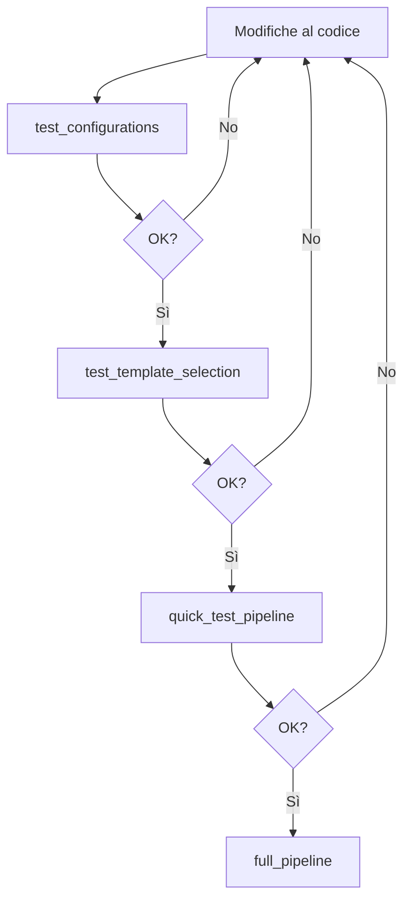

# Guida Pipeline SSM

## Script Disponibili

### 1. Test Rapido (`quick_test_pipeline.m`)
**Tempo**: ~40-50 minuti
**Scopo**: Verificare che tutto funzioni correttamente

```matlab
quick_test_pipeline
```

**Parametri**:
- Template index: 10 (pre-selezionato)
- Rigid iterations: 2
- Non-rigid iterations: 10

**Quando usarlo**:
- ✅ Dopo aver risolto bug
- ✅ Per testare modifiche al codice
- ✅ Per verifiche rapide
- ✅ Durante lo sviluppo

### 2. Pipeline Completa (`full_pipeline.m`)
**Tempo**: ~4-6 ore
**Scopo**: Produrre risultati finali di qualità

```matlab
full_pipeline
```

**Parametri**:
- Template selection: Automatica
- Rigid iterations: 5
- Non-rigid iterations: 50

**Quando usarlo**:
- ✅ Per analisi finale
- ✅ Per risultati da pubblicare
- ✅ Quando la qualità è critica

## Script di Test Unitari

### Test Template Selection (`test_template_selection.m`)
**Tempo**: ~5-10 minuti
Test veloce dell'algoritmo di selezione del template

```matlab
test_template_selection
```

### Test Configurazioni (`test_configurations.m`)
**Tempo**: ~1 minuto
Verifica che tutte le configurazioni siano valide

```matlab
test_configurations
```

## Workflow Consigliato



## Interruzione e Ripresa

Per interrompere: **Ctrl+C**

Per riprendere con parametri diversi:
```matlab
config = pipeline_config();
config.registration.template_index = 10;  % Usa template già calcolato
config.registration.rigid_iters = 2;
config.registration.nonrigid_iters = 10;
run_pipeline('config', config);
```

## Personalizzazione

Puoi modificare i parametri direttamente negli script o creare configurazioni custom:

```matlab
addpath('ssm-new-modules');
config = pipeline_config();

% Personalizza
config.registration.template_index = 5;
config.registration.rigid_iters = 3;
config.registration.nonrigid_iters = 20;

run_pipeline('config', config);
```
